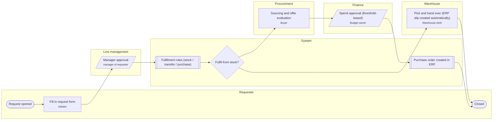

# PR-TOBE: Purchase request (To-Be)

10 steps · 5 human steps · 2 approvals · **0 findings (0 high)**

## Map

Steps with findings are outlined in red.

```mermaid
flowchart LR
    %% PR-TOBE: Purchase request (To-Be)
    subgraph L0["Requester"]
        direction LR
        S0(["Request opened"])
        S1["Fill in request form<br/><small>initiator</small>"]
        E1(["Closed"])
    end
    subgraph L1["Line management"]
        direction LR
        A1[/"Manager approval<br/><small>manager of requester</small>"/]
    end
    subgraph L2["System"]
        direction LR
        R1[["Fulfilment rules (stock / transfer / purchase)"]]
        D1{"Fulfil from stock?"}
        I1[["Purchase order created in ERP"]]
    end
    subgraph L3["Warehouse"]
        direction LR
        W1["Pick and hand over (ERP slip created automatically)<br/><small>Warehouse clerk</small>"]
    end
    subgraph L4["Procurement"]
        direction LR
        P1["Sourcing and offer evaluation<br/><small>Buyer</small>"]
    end
    subgraph L5["Finance"]
        direction LR
        F1[/"Spend approval (threshold-based)<br/><small>Budget owner</small>"/]
    end
    S0 --> S1
    S1 --> A1
    A1 --> R1
    R1 --> D1
    D1 --> W1
    D1 --> P1
    W1 --> E1
    P1 --> F1
    F1 --> I1
    I1 --> E1
```

## Findings

No findings.
